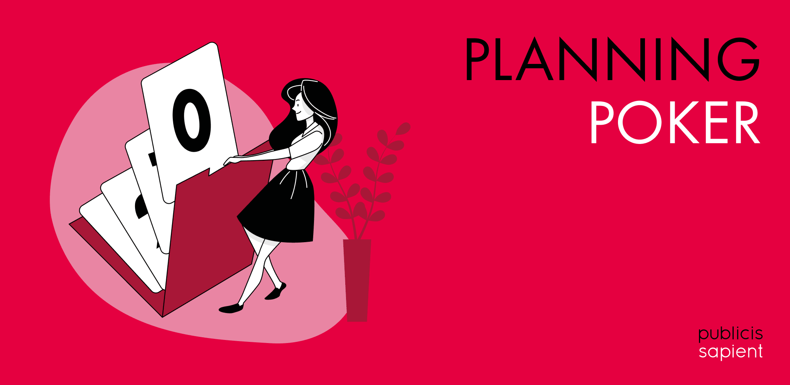

# Planning Poker Android

## Download

## Contribute

> `google-services.json` is mandatory to build this application.
> You may ask top contributors to get access to the Firebase project or create your own.
